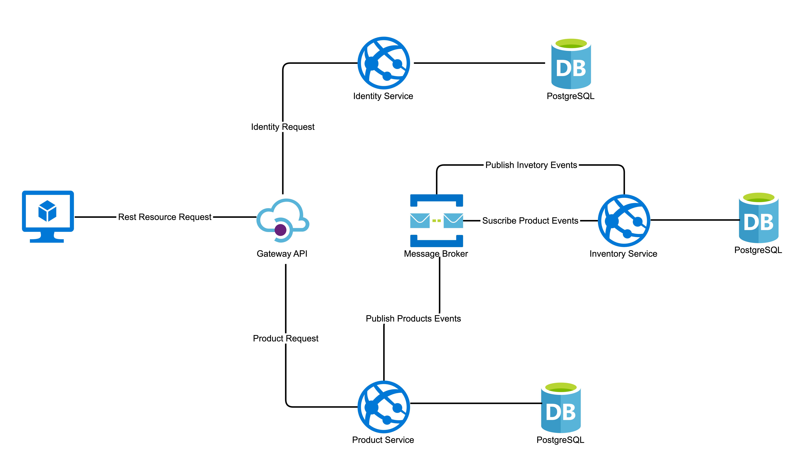

# Shop Golang Microservices

Um microserviço prático e fictício para implementar uma infraestrutura para execução de sistemas distribuídos.

Este projeto não é orientado a negócios e o foco principal foi na parte técnica para implementar um sistema distribuído com um projeto de exemplo.

# Índice

- [Objetivos do Projeto](#objetivos-do-projeto)
- [Plano](#plano)
- [Tecnologias - Bibliotecas](#tecnologias---bibliotecas)
- [Domínio e Contexto Delimitado - Limites de Serviço](#domínio-e-contexto-delimitado---limites-de-serviço)
- [Estrutura do Projeto](#estrutura-do-projeto)
- [Como Executar](#como-executar)
  - [Docker-Compose](#docker-compose)
  - [Compilação](#compilação)
  - [Execução](#execução)
  - [Teste](#teste)
- [APIs de Documentação](#apis-de-documentação)
- [Suporte](#suporte)
- [Contribuição](#contribuição)

## Objetivos do Projeto

- Implementação de uma arquitetura de microserviços.
- Implementação de automação devops com Amazon EKS.
- Implementação de observabilidade com Elastic Search.

## Diagrama de Arquitetura da Solução



## Como Executar

### Docker-Compose
```bash
docker-compose -f ./deployments/docker-compose/infrastructure.yaml up -d
```

### Compilação

```bash
make build
```

### Execução

```bash
make run
```

### Teste

```bash
make test
```

## APIs de Documentação

#### Swagger UI

Após iniciar a aplicação, você pode acessar o Swagger UI em [http://localhost:8080/swagger/index.html](http://localhost:8080/swagger/index.html).

